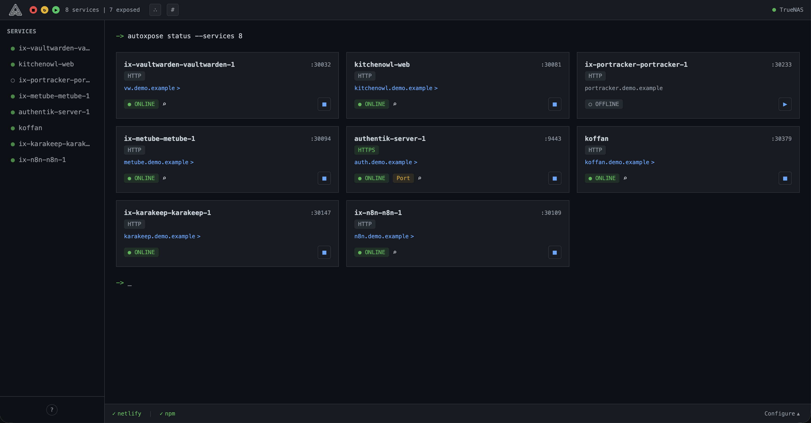

<div align="center" >
  
  <h1 style="font-size: 3em; margin-bottom: 0.1em;">autoxpose</h1>
</div>

<p align="center">
  <strong>Automatic DNS and reverse proxy configuration for Docker containers.</strong>
  <p align="center">
    Add a label to your container, and autoxpose creates the DNS record and configures your reverse proxy with SSL - no manual setup required.
  </p>
</p>

<p align="center">
  <a href="https://github.com/mostafa-wahied/autoxpose/blob/main/LICENSE"></a>
  <a href="https://hub.docker.com/r/mostafawahied/autoxpose"></a>
  <a href="https://github.com/mostafa-wahied/autoxpose/releases"></a>
    <a href="https://github.com/mostafa-wahied/autoxpose/actions"></a>
</p>

<p align="center">
  
</p>

---

## Key Features

- **Automatic Discovery**: Scans Docker containers for autoxpose labels
- **DNS Management**: Creates and removes DNS records with propagation verification
- **SSL & Scheme Auto-Detection**: Automatic HTTPS detection and SSL certificate management
- **Auto-Expose Mode**: Automatically expose services when discovered with `autoxpose.enable=auto`
- **Service Tags**: Auto-categorize services (web, database, media, etc.) with color-coded badges
- **Orphaned Resource Cleanup**: Detect and clean up stale DNS records and proxy hosts
- **Lightweight**: Single container with embedded SQLite database - no external dependencies

## Supported Providers

- **DNS**: Cloudflare, Netlify, DigitalOcean, Porkbun
- **Proxy**: Nginx Proxy Manager, Caddy

## Quick Start

Get autoxpose running in under 5 minutes:

1. **Deploy autoxpose:**

<details open>
<summary>Docker Compose (recommended)</summary>

Create a `docker-compose.yml` file:

```yaml
services:
  autoxpose:
    image: mostafawahied/autoxpose:latest
    ports:
      - '4949:3000'
    environment:
      - SERVER_IP=your-public-ip
      - LAN_IP=your-lan-ip
    volumes:
      - autoxpose-data:/app/packages/backend/data
      - /var/run/docker.sock:/var/run/docker.sock:ro
    restart: unless-stopped

volumes:
  autoxpose-data:
```

Deploy: `docker-compose up -d`

**Note:** This same compose file can be deployed as a stack in **Portainer**.

</details>

<details>
<summary>Docker Run</summary>

```sh
docker run -d \
  --name autoxpose \
  --restart unless-stopped \
  -p 4949:3000 \
  -e SERVER_IP=your-public-ip \
  -e LAN_IP=your-lan-ip \
  -v autoxpose-data:/app/packages/backend/data \
  -v /var/run/docker.sock:/var/run/docker.sock:ro \
  mostafawahied/autoxpose:latest
```

</details>

2. **Access UI:** Open `http://your-server:4949` → Settings

3. **Configure providers:**
   - Add DNS provider (Cloudflare, Netlify, DigitalOcean, or Porkbun)
   - Add Proxy provider (Nginx Proxy Manager or Caddy)

4. **Label your containers:**

   ```yaml
   labels:
     - autoxpose.enable=true # or 'auto' for automatic exposure
   ```

   Container name becomes subdomain by default. To customize:

   ```yaml
   - autoxpose.subdomain=myapp # recommended
   ```

For provider configuration and adding labels by platform, see [Setup Guides](#setup-guides) below.

See the production template at [docker-compose.yaml](./docker-compose.yaml).

## Setup Guides

<details>
<summary><b>DNS Providers</b></summary>

<details style="margin-left: 20px;">
<summary>Cloudflare</summary>

1. Go to [Cloudflare Dashboard](https://dash.cloudflare.com/) → My Profile → API Tokens
2. Click "Create Token" → Use "Edit zone DNS" template
3. **Permissions:** Zone / DNS / Edit
4. **Zone Resources:** Include / Specific zone / yourdomain.com
5. Click "Continue to summary" → "Create Token"
6. Copy the token (shown only once)
7. In autoxpose: Settings → DNS Provider → Cloudflare → Paste token, enter domain

</details>

<details style="margin-left: 20px;">
<summary>Netlify</summary>

1. Go to [Netlify](https://app.netlify.com/) → User Settings → Applications → [Personal access tokens](https://app.netlify.com/user/applications#personal-access-tokens)
2. Click "New access token"
3. Enter description (e.g., "autoxpose DNS")
4. Select expiration date
5. Click "Generate token" → Copy token (shown only once)
6. Get your DNS Zone ID: Go to your site → Site configuration → Domain management → Find the zone ID
7. In autoxpose: Settings → DNS Provider → Netlify → Paste token, enter domain and zone ID

</details>

<details style="margin-left: 20px;">
<summary>DigitalOcean</summary>

1. Go to [DigitalOcean Control Panel](https://cloud.digitalocean.com/) → API → Tokens
2. Click "Generate New Token"
3. **Token name:** autoxpose-dns
4. **Expiration:** Choose duration
5. **Scopes:** Select "Custom Scopes" → Expand "Domains" → Check "Read" and "Create"
6. Click "Generate Token" → Copy token (shown only once)
7. In autoxpose: Settings → DNS Provider → DigitalOcean → Paste token, enter domain

</details>

<details style="margin-left: 20px;">
<summary>Porkbun</summary>

1. Log in to [Porkbun](https://porkbun.com/) → Account → [API Access](https://porkbun.com/account/api)
2. Create API key name → Click "Create API Key"
3. Copy **API Key** and **Secret Key** (shown only once)
4. Click "Domain Management" → Find your domain → Click "Details"
5. Scroll to "API Access" → Toggle to enable
6. In autoxpose: Settings → DNS Provider → Porkbun → Paste API key and secret key, enter domain

</details>

</details>

<details>
<summary><b>Proxy Providers</b></summary>

<details style="margin-left: 20px;">
<summary>Nginx Proxy Manager (npm)</summary>

1. Ensure Nginx Proxy Manager is running and accessible
2. In autoxpose: Settings → Proxy Provider → NPM
   - **URL:** Your NPM URL (e.g., `http://server-ip:npm-port`)
   - **Username:** Your NPM admin email
   - **Password:** Your NPM password

</details>

<details style="margin-left: 20px;">
<summary>Caddy</summary>

1. Ensure Caddy is running with API enabled (default port 2019)
2. Verify API is accessible: `curl http://server-ip:caddy-port/config/`
3. In autoxpose: Settings → Proxy Provider → Caddy
   - **API URL:** `http://server-ip:caddy-port` (internal Docker network IP if containerized)

**Note:** Caddy API has no authentication by default. Ensure the API port is not exposed publicly.

</details>

</details>

<details>
<summary><b>Adding Container Labels by Platform</b></summary>

<details style="margin-left: 20px;">
<summary>TrueNAS Scale</summary>

1. Navigate to **Apps** in TrueNAS web interface
2. Find the app you want to expose and click **Edit**
3. Scroll down to **Labels and Annotations** or **Labels Configuration** section
4. Click **Add** to create a new label:
   - **Key:** `autoxpose.enable`
   - **Value:** `true` or `auto`
5. Click **Add** next to **Containers** and select the application container
   - **Important:** TrueNAS requires specifying which container receives the label
   - For single-container apps: Select the only available container
   - For multi-container apps (e.g., Immich): Select the main application container
6. Repeat steps 4-5 for additional labels (`autoxpose.subdomain`, etc.)
7. Click **Update** - the app will restart with the new labels

</details>

<details style="margin-left: 20px;">
<summary>Docker Compose</summary>

Add under `labels:` key in your service definition:

```yaml
services:
  myapp:
    image: myapp:latest
    labels:
      - autoxpose.enable=true
      - autoxpose.subdomain=myapp
```

Apply changes: `docker-compose up -d`

**Note:** This same approach works when deploying as a stack in Portainer.

</details>

<details style="margin-left: 20px;">
<summary>Docker CLI</summary>

Use `--label` flag:

```sh
docker run -d \
  --name myapp \
  --label autoxpose.enable=true \
  --label autoxpose.subdomain=myapp \
  myapp:latest
```

**Note:** Labels cannot be added to running containers. You must recreate the container with labels.

</details>

</details>

## Configuration

| Variable        | Description                                                  | Required |
| --------------- | ------------------------------------------------------------ | -------- |
| **`SERVER_IP`** | Public IP or hostname for DNS A records                      | **Yes**  |
| **`LAN_IP`**    | LAN/private IP for proxy targets (auto-detected as fallback) | **Yes**  |
| `DOCKER_HOST`   | TCP endpoint when using a socket proxy                       | No       |
| `LOG_LEVEL`     | Logging level: `debug`, `info`, `warn`, `error`              | No       |

DNS and proxy providers are configured through the web UI. See [Setup Guides](#setup-guides) for detailed provider configuration instructions.

### Optional: Docker socket proxy (read-only)

To avoid mounting the Docker socket directly, run through a read-only proxy:

```yaml
services:
  docker-proxy:
    image: tecnativa/docker-socket-proxy:latest
    restart: unless-stopped
    environment:
      - CONTAINERS=1
      - EVENTS=1
      - INFO=1
      - NETWORKS=1
      - POST=0
    volumes:
      - /var/run/docker.sock:/var/run/docker.sock:ro
    ports:
      - '2375:2375'

  autoxpose:
    image: mostafawahied/autoxpose:latest
    ports:
      - '4949:3000'
    environment:
      - SERVER_IP=203.0.113.50
      - LAN_IP=192.168.1.100
      - DOCKER_HOST=tcp://docker-proxy:2375
    volumes:
      - autoxpose-data:/app/packages/backend/data
    depends_on:
      - docker-proxy

volumes:
  autoxpose-data:
```

## Container Labels

Add labels to containers you want to expose:

```yaml
services:
  myapp:
    image: myapp:latest
    labels:
      - autoxpose.enable=true
      - autoxpose.subdomain=myapp
```

| Label                  | Description                                            | Required         |
| ---------------------- | ------------------------------------------------------ | ---------------- |
| **`autoxpose.enable`** | `true` to show in UI, `auto` to auto-expose            | **Yes**          |
| `autoxpose.subdomain`  | Subdomain for the service (defaults to container name) | No (Recommended) |
| `autoxpose.port`       | Override auto-detected port                            | No               |
| `autoxpose.scheme`     | Override auto-detected scheme (`http`/`https`)         | No               |
| `autoxpose.name`       | Display name in UI (default: container name)           | No               |

### Understanding Auto-Expose Modes

| Mode   | Behavior                                                                    |
| ------ | --------------------------------------------------------------------------- |
| `true` | Service discovered and shown in UI - you manually click "Expose" when ready |
| `auto` | Service discovered and automatically exposed - no UI interaction needed     |

## Contributing

Contributions are welcome! Please feel free to open an issue or submit a pull request.

## License

This project is licensed under the MIT License - see the [LICENSE](LICENSE) file for details.
